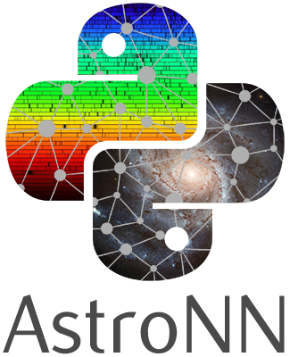

## Getting Started

astroNN is a python package to do various kinds of neural networks with targeted application in astronomy.

For non-astronomy applications, astroNN contains custom loss functions and layers which are compatible with Keras. The custom
loss functions mostly designed to deal with missing labels. astroNN contains demo for implementing Bayesian Neural
Net with Dropout Variational Inference in which you can get reasonable uncertainty estimation and other neural nets.

For astronomy applications, astroNN contains some tools to deal with APOGEE and GAIA data. astroNN is mainly designed
to apply neural nets on APOGEE spectra analysis and predicting absolute magnitude from spectra using data from GAIA parallax with
reasonable uncertainty from Bayesian Neural Net. 
Currently astroNN is a python package being developed by the main author to facilitate his undergraduate research
project on deep learning application in stellar and galactic astronomy using SDSS APOGEE and GAIA satellite data.

For learning purpose, astroNN includes a deep learning toy dataset for astronomer - Galaxy10.

#### [astroNN Documentation](http://astronn.readthedocs.io/)

#### [Quick Start guide](http://astronn.readthedocs.io/en/latest/quick_start.html)

#### [Galaxy10 dataset](http://astronn.readthedocs.io/en/latest/galaxy10.html)

#### [Uncertainty analysis in neural net demo](https://github.com/henrysky/astroNN/tree/master/demo_tutorial/NN_uncertainty_analysis)

#### [GAIA DR2 Preparation and Possible Science with astroNN](http://astronn.readthedocs.io/en/latest/gaia_dr2_special.html)

## Authors

* **Henry Leung** - *Initial work and developer* - [henrysky](https://github.com/henrysky)\
*Astronomy Undergrad, University of Toronto*\
*Contact Henry: henrysky.leung [at] mail.utoronto.ca*

* **Jo Bovy** - [jobovy](https://github.com/jobovy)\
*Astronomy Professor, University of Toronto*\
*Supervisor of **Henry Leung** on this undergraduate project*

## License
This project is licensed under the MIT License - see the [LICENSE](LICENSE) file for details
