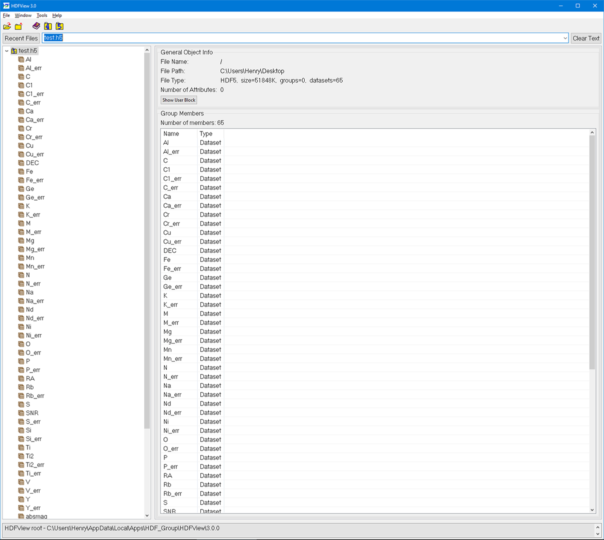

Compiling and Loading APOGEE and Gaia Datasets
===========================================

Compiling Dataset
----------------------
.. code-block:: python

    from astroNN.datasets import H5Compiler

    # To create a astroNN compiler instance
    compiler = H5Compiler()

    # To set the name of the resulting h5 datasets, here a 'test.h5' will be created
    compiler.h5_filename = 'test'

    # To compile a .h5 datasets, use .compile() method
    compiler.compile()

.. code-block:: python
	
	# Avaliable attributes of astroNN H5Compiler, set them before using H5Compiler.compiler()

	H5Compiler.apogee_dr  # APOGEE DR to use, Default is 14
	H5Compiler.gaia_dr  # GAIA DR to use, Default is 1
	H5Compiler.starflagcut = True  # True to filter out ASPCAP star flagged spectra
	H5Compiler.aspcapflagcut = True  # True to filter out ASPCAP flagged spectra
	H5Compiler.vscattercut = 1  # Upper bound of velocity scattering
	H5Compiler.teff_high = 5500  # Upper bound of SNR
	H5Compiler.teff_low = 4000  # Lower bound of SNR
	H5Compiler.SNR_low = 100  # Lower bound of SNR
	H5Compiler.SNR_high = 99999  # Upper bound of SNR
	H5Compiler.ironlow = -3  # Lower bound of SNR
	H5Compiler.filename = None  # Filename of the resulting .h5 file
	H5Compiler.spectra_only = False  # True to include spectra only without any aspcap abundances
	H5Compiler.cont_mask = None  # Continuum Mask, none to use default mask
	H5Compiler.use_apogee = True  # Currently no effect
	H5Compiler.use_esa_gaia = False  # True to use ESA Gaia parallax, **if use_esa_gaia is True, ESA Gaia will has priority over Anderson 2017**
	H5Compiler.use_anderson_2017 = True  # True to use Anderson et al 2017 parallax, **if use_esa_gaia is True, ESA Gaia will has priority**
	H5Compiler.err_info = True  # Whether to include error information in h5 dataset
	H5Compiler.continuum = True  # True to do continuum normalization, False to use aspcap normalized spectra

As a result, test.h5 will be created as shown below. you can use H5View_ to inspect the data

.. note:: It will takes a long time to do the pesudo-continuum normalization. Approx. 60 seconds per 1000 individuals sepctra on a 8 threaded i7 CPU.

.. note:: For more detail on L. Anderson et al. (2017) improved parallax using data-driven stars model: `arXiv:1706.05055`_

Loading Dataset
----------------------

To load a compiled dataset, you can use 

.. code-block:: python
	from astroNN.datasets import H5Loader

	loader = H5Loader('datasets.h5')  # You should replace datasets.h5 with your real filename
	x, y = loader.load()
	loader.load_err = True  # load error info too
	x, y, x_err, y_err = loader.load()

	# Lets say you want to load the corresponding SNR, apparent magnitude and coordinates of the spectra loaded previously
	snr = loader.load_entry('SNR')
	kmag = loader.load_entry('Kmag')
	ra = loader.load_entry('RA')
	dec = loader.load_entry('DEC')

x will be an array of spectra [training data] and y will be an array of ASPCAP labels [training labels]

.. code-block:: python

	#Avaliable attributes of astroNN H5Loader, set them before H5Loader.load()
	H5Loader.load_combined = True # Whether to load combined spectra or individual visits

	#Target 'all' means ['teff', 'logg', 'M', 'alpha', 'C', 'C1', 'N', 'O', 'Na', 'Mg', 'Al', 'Si', 'P', 'S', 'K', 'Ca', 'Ti', 'Ti2', 'V', 'Cr', 
	#'Mn', 'Fe', 'Co', 'Ni', 'fakemag']
	H5Loader.target = 'all'
	
	# Whether to exclude all spectra contains -9999 in any ASPCAP abundances, By default, astroNN can handle -9999 in training data
	H5Loader.exclude9999 = False

	# Whether to load error data
	H5Loader.load_err = True

	# True to load combined spectra, False to load individual visit (If there is any in the h5 dataset you compiled)
	# Training on combined spectra and test on individual spectra is recommended
	H5Loader.load_combined = True

You can also use scikit-learn train_test_split to split x and y into training set and testing set.

In case of APOGEE spectra, x_train and x_test are training and testing spectra. y_train and y_test are training and testing ASPCAP labels

.. code-block:: python
	
	from sklearn.model_selection import train_test_split
	x_train, x_test, y_train, y_test = train_test_split(x, y, test_size=0.2)

.. _H5View: https://www.hdfgroup.org/downloads/hdfview/
.. _arXiv:1706.05055: https://arxiv.org/abs/1706.05055