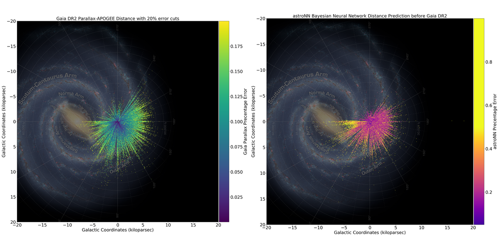
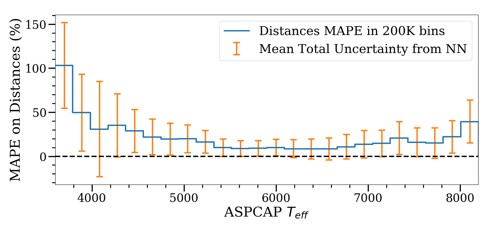
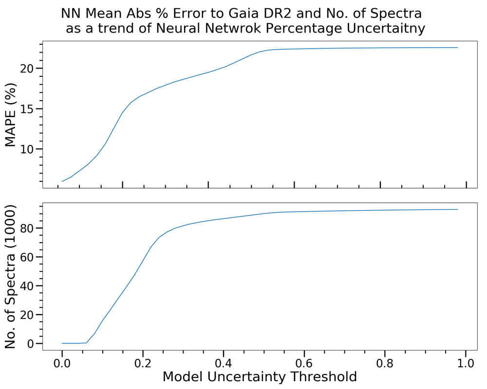
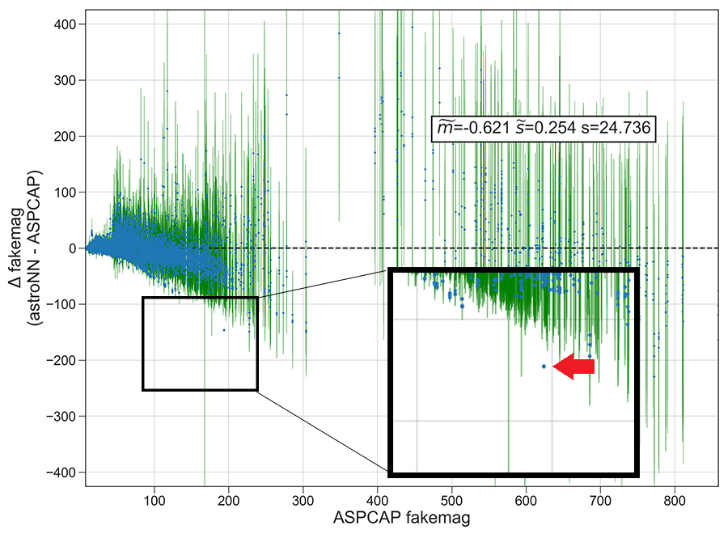
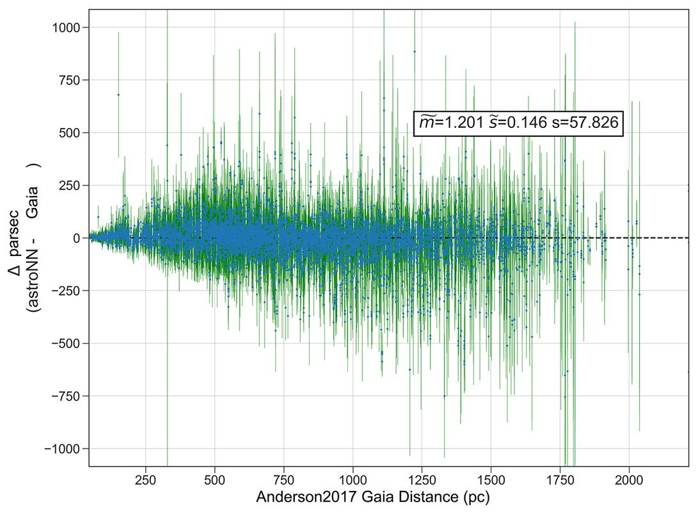
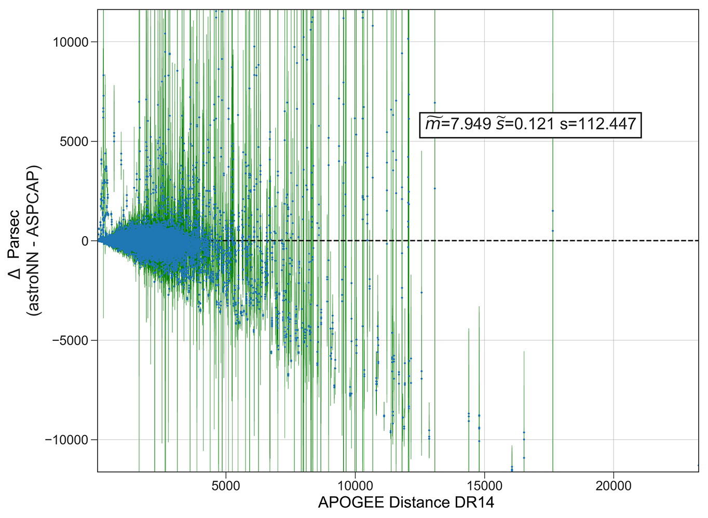
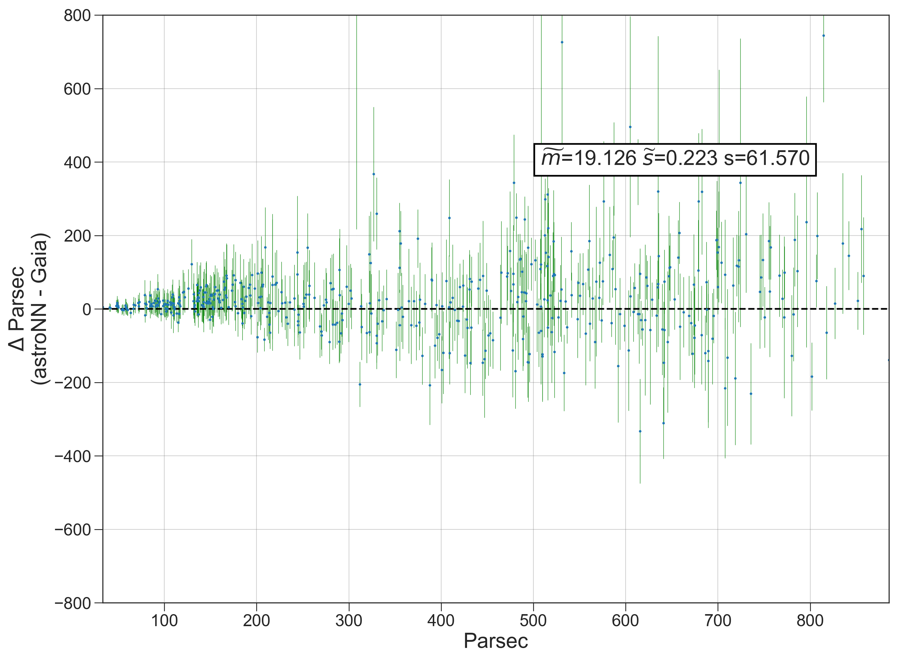
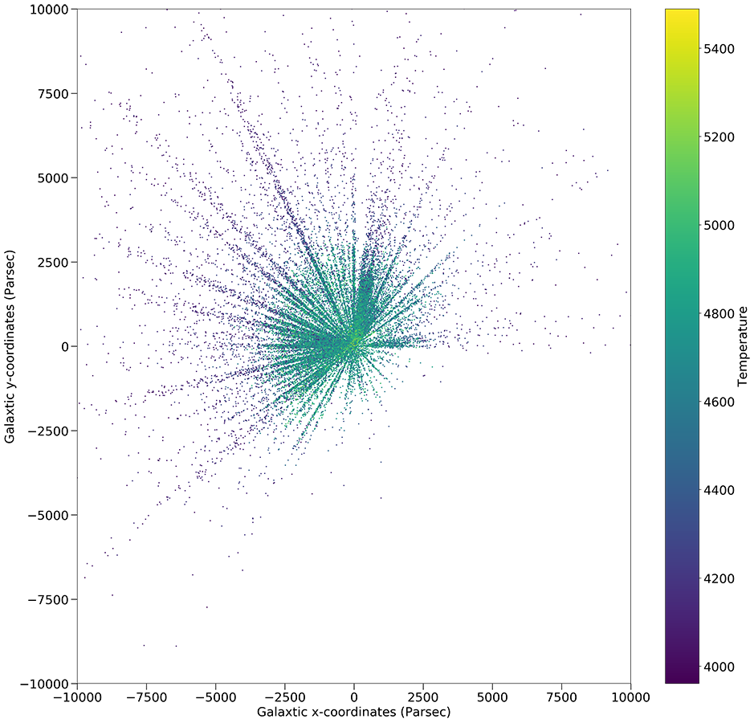
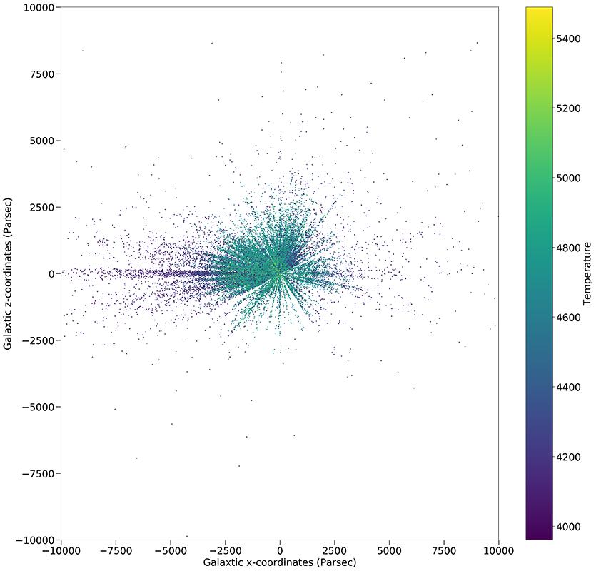

Gaia DR2 with astroNN result
================================

Gaia DR2 is released on 25 April 2018 with data collected from 25 July 2014 to 23 May 2016 with 1.5 billion sources.

Official Gaia DR2 page: https://www.cosmos.esa.int/web/gaia/dr2

astroNN is used to train neural network with Gaia DR1 parallax to predict intrinsic brightness of stars from APOGEE
spectra. Since Gaia uses geometric method to infer distances to stars, and it has its own limitation, the major one
will be the star must be close to us. If neural network can infer intrinsic brightness based on APOGEE spectra, with apparent
magnitude we can get the distance as long as we have the stellar spectra.

This page will act as a notebook for the author (Henry) and share his latest update on Gaia DR2 preparation.

FAQ: What is fakemag? : https://astronn.readthedocs.io/en/latest/tools_gaia.html#fakemag-dummy-scale

FAQ: Which band I will use for apparent magnitude?: K-mag will be used to minimize the effect of extinction

(25 Apr 2018 update) Neural Network Distance Prediction on the whole APOGEE DR14 result with Gaia DR2
-------------------------------------------------------------------------------------------------------

Procedure to reproduce the result is described here: https://github.com/henrysky/astroNN/tree/master/demo_tutorial/gaia_dr1_dr2/

Neural Network trained only Gaia DR1 (20% parallax error cuts)-APOGEE DR14 (SNR>50, STARFLAG==0) overlap, around 12,000 spectra. Results are
expressed in mean absolute percentage error. Gaia DR2 refers to the subset of DR2 matched with Apogee DR14, parallax > 0 and parallax error < 0.2

**Outperformed Apogee Distances DR14 BPG Catalog**:

- Apogee Distances DR14 BPG (20% Model Confidence Cut): 77,401 spectra - 20.6%
- ``astroNN ApogeeBCNN`` (20% Neural Network Confidence Cut): 57,704 spectra - 14.5%
- ``astroNN ApogeeBCNN`` (25% Neural Network Confidence Cut): 76,136 spectra - 16.8%
- ``astroNN ApogeeBCNN`` (100% Neural Network Confidence Cut): 92,887 spectra - 22.6%

**Outperformed “teacher” Gaia DR1 with 20% error cuts slightly on training set spectra**:

- ``astroNN ApogeeBCNN`` (20% Neural Network Confidence Cut): 10,039 spectra - 6.74% mean absolute percentage error with DR2
- Gaia DR1 (20% error cuts): 9,019 spectra - 6.97% mean absolute percentage error with DR2

**Gaia DR1, Anderson2017 with 20% error cuts in APOGEE DR14 crossed matched**:

- Gaia DR1 (20% Observation Error Cut): 20,675 spectra - 8.3% mean absolute percentage error with DR2
- Anderson2017 (20% Model Confidence Cut): 25,303 spectra - 8.4% mean absolute percentage error with DR2

**Apogee Red Clumps - astroNN - Gaia DR2 crossed matched, Red Clumps Catalog DR14 is better than NN**:

- The whole Red Clumps Catalog: 22,421 spectra - 20.6% mean absolute percentage error with DR2
- Red Clumps Catalog crossed matched: 12,476 spectra - 18.9% mean absolute percentage error with DR2
- astroNN crossed matched: 12,476 spectra - 25.0% mean absolute percentage error with DR2

Internal model identifier for the author: ``astroNN_0422_run001``

**Neural Network Mean Absolute Percentage Error to Gaia DR2 as a function of Teff**

**Neural Network Mean Absolute Percentage Error to Gaia DR2 as a function of neural network uncertainty estimation**

Plans/Questions
------------------

#. Train neural network on Gaia DR1 and validate on Gaia DR2 (result stated above)
#. Temperature cuts on spectra? (Didn't do it)

#. If neural network turns out very accurate when DR2 comes out, how did neural network predict those distance?
#. If neural network turns out very accurate when DR2 comes out, then we can get distance for many APOGEE spectra?
#. (No Need, the result is pretty good) If neural network failed, is predicting intrinsic brightness from APOGEE spectra impossible, or just because the training set is too small in DR1 led to failure?

Nerual Network Distance Prediction on the whole APOGEE DR14
--------------------------------------------------------------

Neural Network trained only Gaia DR1 (20% parallax error cuts)-APOGEE DR14 (SNR>50, STARFLAG==0) overlap

Testing on the whole APOGEE DR14 (SNR>50, STARFLAG==0 cuts), around ~120,000 spectra

.. image:: gaia_dr2/dr1_coverage_apogee.png

2M16363993+3654060 Distance Disagreement between astroNN and Gaia/Anderson2017 Parallax
-----------------------------------------------------------------------------------------

Internal model identifier for the author: ``astroNN_0128_run002``

Neural Network trained on Anderson2017 parallax constantly predicted an almost constant offset with very small uncertainty
to the ground truth (Anderson2017) on the star with APOGEE_ID `2M16363993+3654060`. astroNN agreed pretty well with APOGEE_distances BPG_dist50.
Seems like Gaia/Anderson2017 are the one which is far off.

I have to emphasise that the neural network is trained on the parallax from Anderson2017 which is improved parallax
from Gaia DR1. There is no surprise that neural network identified outliers from the training/testing set. But
the fact that neural network managed to have a similar answer with `APOGEE_distances BPG_dist50` may indicate neural
network learned some "correct" physics to infer intrinsic distance from APOGEE spectra.

The result:

#. astroNN Bayesian Neural Network [#f1]_ : :math:`2287.61 \text{ parsec} \pm 107.27 \text{ parsec}`
#. APOGEE_distances BPG_dist50 [#f2]_ : :math:`2266.15 \text{ parsec} \pm 266.1705 \text{ parsec}`
#. Anderson2017 parallax: :math:`568.08 \text{ parsec} \pm 403.86 \text{ parsec}`
#. Gaia DR1 parallax: :math:`318.05 \text{ parsec} \pm 1021.73 \text{ parsec}`

.. rubric:: Footnotes

.. [#f1] Trained on ASPCAP parameters [Teff, Log(g) and 22 abundances] and Anderson2017 parallax
.. [#f2] https://www.sdss.org/dr14/data_access/value-added-catalogs/?vac_id=apogee-dr14-based-distance-estimations

Distance Prediction with APOGEE-North Spectra
----------------------------------------------------

Internal model identifier for the author: ``astroNN_0224_run002``

By using `astroNN.models.Apogee_BCNN` to train a neural network on Anderson2017 improved Gaia parallax (Predict stellar
intrinsic brightness from their spectra). Here is the result

#. First image, Anderson2017 is the ground truth and tested the neural network on individual spectra
#. Second image, assume APOGEE Distances DR14 is the ground truth, tested the neural network on individual spectra

Distance Prediction with APOGEE-South Spectra
----------------------------------------------------

Internal model identifier for the author: ``astroNN_0224_run002``

The neural network has trained on APOGEE-North spectra and gaia parallax. And then neural network has been tested on
spectra from APOGEE-South (Different telescope and cameras)

Milkyway via the Eye of Neural Network
---------------------------------------

Internal model identifier for the author: ``astroNN_0224_run002``

Both the temperature and distance are the prediction from neural network. Combined with the observed coordinates and
apparent magnitude, we can get a 3D map of stellar parameters via a neural network.

It seems like the neural network constantly overestimating the intrinsic brightness of low temperature stars, thats why
it seems like low temperature stars dominated at distant.

