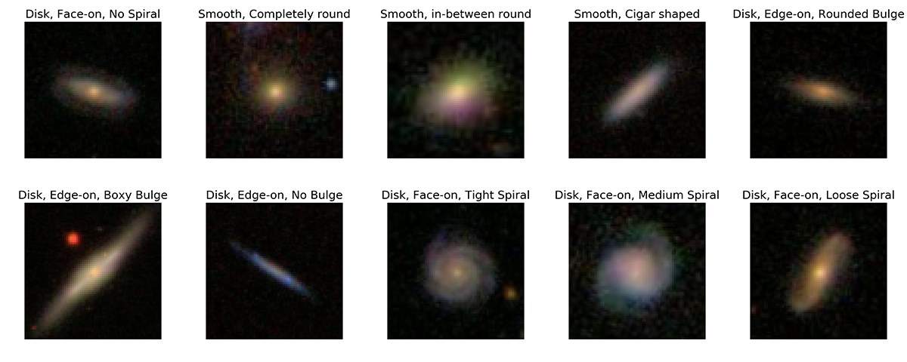

.. automodule:: astroNN.datasets.galaxy10

Galaxy10 DECals Dataset
==========================

Welcome! Galaxy10 DECals is a much improved version of our original `Galaxy10`_. The source code is here: https://github.com/henrysky/Galaxy10

The original Galaxy10 dataset was created with Galaxy Zoo (GZ) Data Release 2 where volunteers classify ~270k of SDSS galaxy images where ~22k of those images 
were selected in 10 broad classes using volunteer votes. GZ later utilized images from `DESI Legacy Imaging Surveys`_ (DECals) with much better resolution and image quality.
Galaxy10 DECals has combined all three (GZ DR2 with DECals images instead of SDSS images and  DECals campaign ab, c) results in ~441k of unique galaxies covered by DECals
where ~18k of those images were selected in 10 broad classes using volunteer votes with more rigorous filtering. Galaxy10 DECals had its 10 broad classes tweaked a bit so that
each class is more distinct from each other and ``Edge-on Disk with Boxy Bulge`` class with only 17 images in original Galaxy10 was abandoned. The source code for this dataset is released
under this repositary so you are welcome to play around if you like, otherwise you can use the compiled Galaxy10 DECals with dowload link below.

Download Galaxy10 DECals
--------------------------

``Galaxy10_DECals.h5``: https://www.astro.utoronto.ca/~hleung/shared/Galaxy10/Galaxy10_DECals.h5

SHA256: ``19AEFC477C41BB7F77FF07599A6B82A038DC042F889A111B0D4D98BB755C1571``

Size: 2.54 GB

Introduction
---------------

Galaxy10 DECals is a dataset contains 17736 256x256 pixels colored galaxy images (g, r and z band) separated in 10 classes. 
``Galaxy10_DECals.h5`` have columns ``images`` with shape ``(17736, 256, 256, 3)``, ``ans``, ``ra``, ``dec``, 
``redshift`` and ``pxscale`` in unit of arcsecond per pixel

Galaxy10 DECals images come from `DESI Legacy Imaging Surveys`_ and labels come from `Galaxy Zoo`_.

::

    Galaxy10 dataset (17736 images)
    ├── Class 0 (1081 images): Disturbed Galaxies
    ├── Class 1 (1853 images): Merging Galaxies
    ├── Class 2 (2645 images): Round Smooth Galaxies
    ├── Class 3 (2027 images): In-between Round Smooth Galaxies
    ├── Class 4 ( 334 images): Cigar Shaped Smooth Galaxies
    ├── Class 5 (2043 images): Barred Spiral Galaxies
    ├── Class 6 (1829 images): Unbarred Tight Spiral Galaxies
    ├── Class 7 (2628 images): Unbarred Loose Spiral Galaxies
    ├── Class 8 (1423 images): Edge-on Galaxies without Bulge
    └── Class 9 (1873 images): Edge-on Galaxies with Bulge

For more information on the original Galaxy Zoo 2 classification tree: `Galaxy Zoo Decision Tree`_

.. _Galaxy Zoo Decision Tree: https://data.galaxyzoo.org/gz_trees/gz_trees.html

Load with astroNN
-------------------

.. code-block:: python
    :linenos:

    from astroNN.datasets import load_galaxy10
    from tensorflow.keras import utils
    import numpy as np

    # To load images and labels (will download automatically at the first time)
    # First time downloading location will be ~/.astroNN/datasets/
    images, labels = load_galaxy10()

    # To convert the labels to categorical 10 classes
    labels = utils.to_categorical(labels, 10)

    # To convert to desirable type
    labels = labels.astype(np.float32)
    images = images.astype(np.float32)

OR Load with Python & h5py
----------------------------

You should download ``Galaxy10_DECals.h5`` first and open python at the same location and run the following to open it:

.. code-block:: python
    :linenos:
    
    import h5py
    import numpy as np
    from tensorflow.keras import utils

    # To get the images and labels from file
    with h5py.File('Galaxy10_DECals.h5', 'r') as F:
        images = np.array(F['images'])
        labels = np.array(F['ans'])

    # To convert the labels to categorical 10 classes
    labels = utils.to_categorical(labels, 10)

    # To convert to desirable type
    labels = labels.astype(np.float32)
    images = images.astype(np.float32)

Split into train and test set
----------------------------------

.. code-block:: python
    :linenos:
    
    import numpy as np
    from sklearn.model_selection import train_test_split

    train_idx, test_idx = train_test_split(np.arange(labels.shape[0]), test_size=0.1)
    train_images, train_labels, test_images, test_labels = images[train_idx], labels[train_idx], images[test_idx], labels[test_idx]

Lookup Galaxy10 Class
--------------------------

You can lookup Galaxy10 class to the corresponding name by

.. code-block:: python
    :linenos:
    
    from astroNN.datasets.galaxy10 import galaxy10cls_lookup
    galaxy10cls_lookup(# a class number here to get back the name)

Galaxy10 Dataset Authors
-------------------------

-  | **Henry Leung** - henrysky_
   | Department of Astronomy & Astrophysics, University of Toronto

-  | **Jo Bovy** - jobovy_
   | Department of Astronomy & Astrophysics, University of Toronto

.. _henrysky: https://github.com/henrysky
.. _jobovy: https://github.com/jobovy

Acknowledgments
------------------

For astroNN Acknowledgments, please refers to :ref:`Acknowledging astroNN`

1. Galaxy10 dataset classification labels come from `Galaxy Zoo`_
2. Galaxy10 dataset images come from `DESI Legacy Imaging Surveys`_

Galaxy Zoo is described in `Lintott et al. 2008`_, the GalaxyZoo Data Release 2 is described in `Lintott et al. 2011`_, Galaxy Zoo DECals Campaign is described in 
`Walmsley M. et al. 2021`_, DESI Legacy Imaging Surveys is described in `Dey A. et al., 2019`_

The Legacy Surveys consist of three individual and complementary projects: the Dark Energy Camera Legacy Survey (DECaLS; Proposal ID #2014B-0404; PIs: David Schlegel and Arjun Dey), the Beijing-Arizona Sky Survey (BASS; NOAO Prop. ID #2015A-0801; PIs: Zhou Xu and Xiaohui Fan), and the Mayall z-band Legacy Survey (MzLS; Prop. ID #2016A-0453; PI: Arjun Dey). DECaLS, BASS and MzLS together include data obtained, respectively, at the Blanco telescope, Cerro Tololo Inter-American Observatory, NSF’s NOIRLab; the Bok telescope, Steward Observatory, University of Arizona; and the Mayall telescope, Kitt Peak National Observatory, NOIRLab. The Legacy Surveys project is honored to be permitted to conduct astronomical research on Iolkam Du’ag (Kitt Peak), a mountain with particular significance to the Tohono O’odham Nation.

.. _DESI Legacy Imaging Surveys: https://www.legacysurvey.org/
.. _Galaxy Zoo: https://www.galaxyzoo.org/
.. _Lintott et al. 2008: https://ui.adsabs.harvard.edu/abs/2008MNRAS.389.1179L/abstract
.. _Lintott et al. 2011: https://ui.adsabs.harvard.edu/abs/2011MNRAS.410..166L/abstract
.. _Walmsley M. et al. 2021: https://ui.adsabs.harvard.edu/abs/2021arXiv210208414W/abstract
.. _Dey A. et al., 2019: https://ui.adsabs.harvard.edu/abs/2019AJ....157..168D/abstract
.. _Galaxy10: https://astronn.readthedocs.io/en/latest/galaxy10.html

Some papers that used Galaxy 10
--------------------------------

#. | DeepAstroUDA: Semi-Supervised Universal Domain Adaptation for Cross-Survey Galaxy Morphology Classification and Anomaly Detection
   | Aleksandra Ćiprijanović et al (2023)
   | `arXiv:2302.02005 <https://ui.adsabs.harvard.edu/abs/2023arXiv230202005C/abstract>`_
#. | Semi-Supervised Domain Adaptation for Cross-Survey Galaxy Morphology Classification and Anomaly Detection
   | Aleksandra Ćiprijanović et al (2022)
   | `arXiv:2211.00677 <https://ui.adsabs.harvard.edu/abs/2022arXiv221100677C/abstract>`_
#. | Equivariance-aware Architectural Optimization of Neural Networks
   | Kaitlin Maile et al (2022)
   | `arXiv:2210.05484 <https://arxiv.org/abs/2210.05484>`_
#. | Galaxy Morphology Classification with DenseNet
   | Wuyu Hui  et al (2022)
   | `JPhCS, 2402, 012009 <https://ui.adsabs.harvard.edu/abs/2022JPhCS2402a2009H/abstract>`_
#. | Learning to Detect Interesting Anomalies
   | Alireza Vafaei Sadr et al (2022)
   | `arXiv:2210.16334 <https://ui.adsabs.harvard.edu/abs/2022arXiv221016334V/abstract>`_
#. | Machine learning in introductory astrophysics laboratory activities
   | Alireza Vafaei Sadr (2022)
   | `PhTea, 59, 662 <https://ui.adsabs.harvard.edu/abs/2021PhTea..59..662S/abstract>`_
#. | Physics-Integrated Variational Autoencoders for Robust and Interpretable Generative Modeling
   | Naoya Takeishi et al (2021)
   | `arXiv:2102.13156 <https://ui.adsabs.harvard.edu/abs/2021arXiv210213156T/abstract>`_
#. | SetGAN: Improving the stability and diversity of generative models through a permutation invariant architecture
   | Alessandro Ferrero et al (2019)
   | `arXiv:1907.00109 <https://ui.adsabs.harvard.edu/abs/2019arXiv190700109F/abstract>`_
#. | Input Selection for Bandwidth-Limited Neural Network Inference
   | Stefan Oehmcke et al (2019)
   | `arXiv:1906.04673 <https://ui.adsabs.harvard.edu/abs/2019arXiv190604673O/abstract>`_
