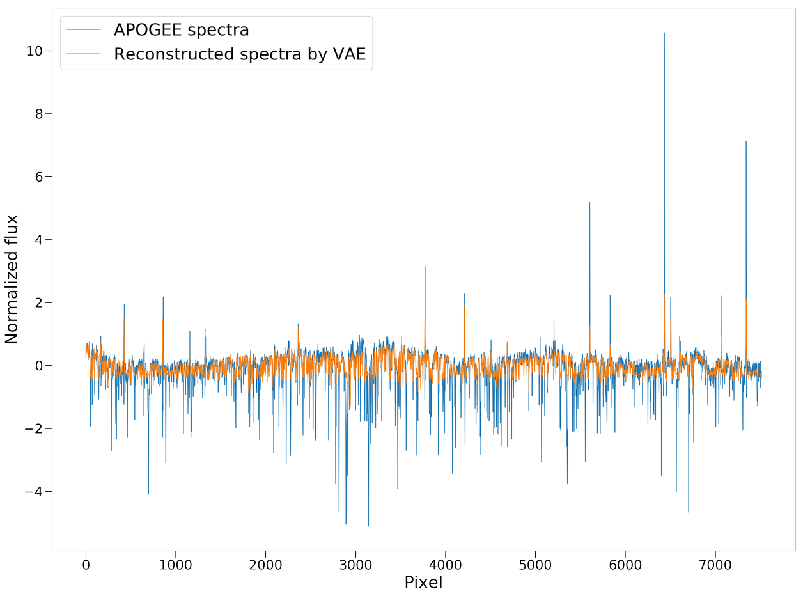

.. astroNN documentation master file, created by
   sphinx-quickstart on Thu Dec 21 17:52:45 2017.
   You can adapt this file completely to your liking, but it should at least
   contain the root `toctree` directive.

Convolutional Variational Autoencoder
--------------------------------------

astroNN.models.VAE is a 9 layered convolutional neural net (2 convolutional layers->2 dense layers->latent space->2 dense layers->2 convolutional layers)

You can create VAE via

.. code:: python

    from astroNN.models import VAE

    # And then create an object of StarNet classs
    vae_net = VAE()

APOGEE Spectra Analysis
--------------------------------------------------

Althought in theory you can feed any 1D data to astroNN neural networks. This tutorial will only focus on spectra analysis.

.. code:: python

    from astroNN.models import CVAE
    from astroNN.datasets import H5Loader

    # Load the train data from dataset first, x_train is spectra and y_train will be ASPCAP labels
    loader = H5Loader('datasets.h5')
    x_train, y_train = loader.load()

    # And then create an object of Bayesian Convolutional Neural Network classs
    vae_net = CVAE()

    # Set max_epochs to 10 for a quick result. You should train more epochs normally, especially with dropout
    vae_net.max_epochs = 10
    vae_net.train(x_train)

After the training, you can use 'vae_net' in this case and call test method to test the neural network on test data. Or you can load the folder by

.. code:: python

    from astroNN.models import load_folder
    vae_net = load_folder('astroNN_0101_run001')

    # Load the test data from dataset, x_test is spectra and y_test will be ASPCAP labels
    loader2 = H5Loader('datasets.h5')
    loader2.load_combined = False
    x_test, y_test = loader2.load()

VAE is a special case. You can either use test_encoder(x_test) to get the value in latent space or use test(x_test) to get spectra reconstruction

.. code:: python

    # Get latent space representation
    latent_space_value = vae_net.test_encoder(x_test)

    # Get spectra reconstruction
    spectra_recon = vae_net.test(x_test)

.. note:: You can access to Keras model method like model.predict via (in the above tutorial) vae_net.keras_model (Example: vae_net.keras_model.predict())

Example Plots on latent space using VAE.plot_latent()
========================================================

.. image:: vae_demo/C.jpg
.. image:: vae_demo/logg.jpg

Example Plots on spectra reconstruction
========================================================

.. code:: python

    x_re = vae_net.test(x_test)

    import pylab as plt

    fig = plt.figure(figsize=(20, 15), dpi=150)
    plt.plot(x[0], linewidth=0.9, label='APOGEE spectra')
    plt.plot(x_re[0], linewidth=0.9, label='Reconstructed spectra by VAE')
    plt.xlabel('Pixel', fontsize=25)
    plt.ylabel('Normalized flux', fontsize=25)
    plt.legend(loc='best', fontsize=25)
    plt.tick_params(labelsize=20, width=1, length=10)

