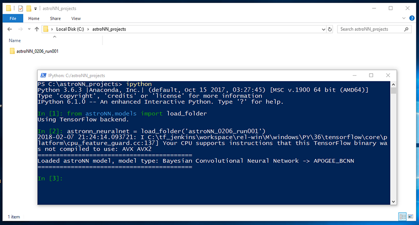
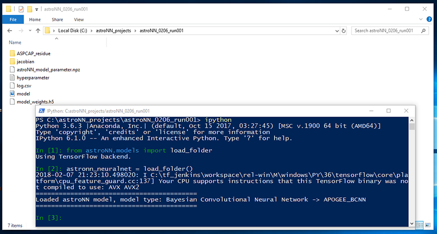

.. automodule:: astroNN.models

Neural Nets Classes and Basic Usage
=========================================================

Available astroNN Neural Net Classes
--------------------------------------

All astroNN Neural Nets are inherited from some child classes which inherited NeuralNetMaster, NeuralNetMaster also
relies relies on two major component, `Normalizer` and `GeneratorMaster`

::

    Normalizer (astroNN.nn.utilities.normalizer.Normalizer)

    GeneratorMaster (astroNN.nn.utilities.generator.GeneratorMaster)
    ├── CNNDataGenerator
    ├── Bayesian_DataGenerator
    └── CVAE_DataGenerator

    NeuralNetMaster (astroNN.models.base_master_nn.NeuralNetMaster)
    ├── CNNBase
    │   ├── ApogeeCNN
    │   ├── StarNet2017
    │   ├── ApogeeKplerEchelle
    │   ├── SimplePloyNN
    │   └── Cifar10CNN
    ├── BayesianCNNBase
    │   ├── MNIST_BCNN  # For authors testing only
    │   ├── ApogeeBCNNCensored
    │   └── ApogeeBCNN
    ├── ConvVAEBase
    │   └── ApogeeCVAE  # For authors testing only
    └── CGANBase
        └── GalaxyGAN2017  # For authors testing only

NeuralNetMaster Class API
------------------------------

All astroNN Neural Nets classes inherited from this  ``astroNN.models.base_master_nn.NeuralNetMaster`` and thus methods
of this class is shared across all astroNN Neural Nets classes.

.. autoclass:: astroNN.models.base_master_nn.NeuralNetMaster
    :members:

-----------
CNNBase
-----------

Documented Members:

* :meth:`astroNN.models.apogee_models.ApogeeCNN`

* :meth:`astroNN.models.apogee_models.StarNet2017`

* :meth:`astroNN.models.SimplePloyNN`

.. autoclass:: astroNN.models.base_cnn.CNNBase
    :members:

-----------------
BayesianCNNBase
-----------------

Documented Members:

* :meth:`astroNN.models.apogee_models.ApogeeBCNN`

* :meth:`astroNN.models.apogee_models.ApogeeBCNNCensored`

.. autoclass:: astroNN.models.base_bayesian_cnn.BayesianCNNBase
    :members:

-----------------
ConvVAEBase
-----------------

Documented Members:

* :meth:`astroNN.models.apogee_models.ApogeeCVAE`

.. autoclass:: astroNN.models.base_vae.ConvVAEBase
    :members:

Workflow of Setting up astroNN Neural Nets Instances and Training
--------------------------------------------------------------------

astroNN contains some predefined neural networks which work well in certain aspect. For most general usage, I recommend
you to create your own neural network for more flexibility and take advantage of astroNN custom loss function or layers.

For predefined neural network, generally you have to setup an instances of astroNN Neural Nets class with some predefined architecture. For example,

.. code-block:: python
    :linenos:
    
    # import the neural net class from astroNN first
    from astroNN.models import ApogeeCNN

    # astronn_neuralnet is an astroNN's neural network instance
    # In this case, it is an instance of ApogeeCNN
    astronn_neuralnet = ApogeeCNN()

Lets say you have your training data prepared, you should specify what the neural network is outputing by setting up the `targetname`

.. code-block:: python
    :linenos:
    
    # Just an example, if the training data is Teff, logg, Fe and absmag
    astronn_neuralnet.targetname = ['teff', 'logg', 'Fe', 'absmag']

By default, astroNN will generate folder name automatically with naming scheme ``astroNN_[month][day]_run[run number]``.
But you can specify custom name by

.. code-block:: python
    :linenos:
    
    # astronn_neuralnet is an astroNN's neural network instance
    astronn_neuralnet.folder_name = 'some_custom_name'

You can enable autosave (save all stuffs immediately after training or save it yourself by

.. code-block:: python
    :linenos:
    
    # To enable autosave
    astronn_neuralnet.autosave = True

    # To save all the stuffs, model_plot=True to plot models too, otherwise wont plot, needs pydot_ng and graphviz
    astronn_neuralnet.save(model_plot=False)

astroNN will normalize your data after you called `train()` method. The advantage of it is if you are using normalization
provided by astroNN, you can make sure when `test()` method is called, the testing data will be normalized and prediction will
be denormalized in the exact same way as training data. This can minimize human error.

If you want to normalize by yourself, you can disable it by

.. code-block:: python
    :linenos:
    
    # astronn_neuralnet is an astroNN's neural network instance
    astronn_neuralnet.input_norm_mode=0
    astronn_neuralnet.labels_norm_mode = 0

You can add a list of Keras/astroNN callback by

.. code-block:: python
    :linenos:
    
    astronn_neuralnet.callbacks = [# some callback(s) here)]

So now everything is set up for training

.. code-block:: python
    :linenos:
    
    # Start the training
    astronn_neuralnet.train(x_train,y_train)

If you did not enable autosave, you can save it after training by

.. code-block:: python
    :linenos:
    
    # To save all the stuffs, model_plot=True to plot models too, otherwise wont plot, needs pydot_ng and graphviz
    astronn_neuralnet.save(model_plot=False)

Load astroNN Generated Folders
-------------------------------------

First way to load a astroNN generated folder, you can use the following code. You need to replace ``astroNN_0101_run001``
with the folder name. should be something like ``astroNN_[month][day]_run[run number]``

.. autofunction:: astroNN.models.load_folder

.. code-block:: python
    :linenos:
    
    from astroNN.models import load_folder
    astronn_neuralnet = load_folder('astroNN_0101_run001')

OR second way to open astroNN generated folders is to open the folder and run command line window inside there, or switch
directory of your command line window inside the folder and run

.. code-block:: python
    :linenos:
    
    from astroNN.models import load_folder
    astronn_neuralnet = load_folder()

`astronn_neuralnet` will be an astroNN neural network object in this case.
It depends on the neural network type which astroNN will detect it automatically,
you can access to some methods like doing inference or continue the training (fine-tuning).
You should refer to the tutorial for each type of neural network for more detail.

There is a few parameters from keras_model you can always access,

.. code-block:: python
    :linenos:
    
    # The model summary from Keras
    astronn_neuralnet.keras_model.summary()

    # The model input
    astronn_neuralnet.keras_model.input

    # The model input shape expectation
    astronn_neuralnet.keras_model.input_shape

    # The model output
    astronn_neuralnet.keras_model.output

    # The model output shape expectation
    astronn_neuralnet.keras_model.output_shape

astroNN neuralnet object also carries `targetname` (hopefully correctly set by the writer of neural net), parameters
used to normalize the training data (The normalization of training and testing data must be the same)

.. code-block:: python
    :linenos:
    
    # The tragetname corresponding to output neurone
    astronn_neuralnet.targetname

    # The model input
    astronn_neuralnet.keras_model.input

    # The mean used to normalized training data
    astronn_neuralnet.input_mean_norm

    # The standard derivation used to normalized training data
    astronn_neuralnet.input_std_norm

    # The mean used to normalized training labels
    astronn_neuralnet.labels_mean_norm

    # The standard derivation used to normalized training labels
    astronn_neuralnet.labels_std_norm

Load and Use Multiple astroNN Generated Folders
----------------------------------------------------

.. note::

    astroNN fully supports eager execution now and you no longer need to context manage graph and session in order to use
    multiple model at the same time

It is tricky to load and use multiple models at once since keras share a global session by default if no default
tensorflow session provided and astroNN might encounter namespaces/scopes collision. So astroNN assign seperate Graph and
Session for each astroNN neural network model. You can do:

.. code-block:: python
    :linenos:
    
    from astroNN.models import load_folder

    astronn_model_1 = load_folder("astronn_model_1")
    astronn_model_2 = load_folder("astronn_model_2")
    astronn_model_3 = load_folder("astronn_model_3")

    with astronn_model_1.graph.as_default():
        with astronn_model_1.session.as_default():
            # do stuff with astronn_model_1 here

    with astronn_model_2.graph.as_default():
        with astronn_model_2.session.as_default():
            # do stuff with astronn_model_2 here

    with astronn_model_3.graph.as_default():
        with astronn_model_3.session.as_default():
            # do stuff with astronn_model_3 here

    # For example do things with astronn_model_1 again
    with astronn_model_1.graph.as_default():
        with astronn_model_1.session.as_default():
            # do more stuff with astronn_model_1 here

Workflow of Testing and Distributing astroNN Models
-------------------------------------------------------

The first step of the workflow should be loading an astroNN folder as described above.

Lets say you have loaded the folder and have some testing data, you just need to provide the testing data without
any normalization if you used astroNN normalization during training. The testing data will be normalized and prediction will
be denormalized in the exact same way as training data.

.. code-block:: python
    :linenos:
    
    # Run forward pass for the test data throught the neural net to get prediction
    # The prediction should be denormalized if you use astroNN normalization during training
    prediction = astronn_neuralnet.test(x_test)

You can always train on new data based on existing weights

.. code-block:: python
    :linenos:
    
    # Start the training on existing models (fine-tuning), astronn_neuralnet is a trained astroNN models
    astronn_neuralnet.train(x_train,y_train)

Creating Your Own Model with astroNN Neural Net Classes
----------------------------------------------------------

You can create your own neural network model inherits from astroNN Neural Network class to take advantage of the existing
code in this package. Here we will go thought how to create a simple model to do classification with MNIST dataset with
one convolutional layer and one fully connected layer neural network.

Lets create a python script named ``custom_models.py`` under an arbitrary folder, lets say ``~/`` which is your home folder,
add ``~/custom_models.py`` to astroNN configuration file.

.. code-block:: python
    :linenos:
    
    # import everything we need
    import keras
    # this is the astroNN neural net abstract class we will going to inherit from
    from astroNN.models.CNNBase import CNNBase

    regularizers = keras.regularizers
    MaxPooling2D, Conv2D, Dense, Flatten, Activation, Input = keras.layers.MaxPooling2D, keras.layers.Conv2D, \
                                                              keras.layers.Dense, keras.layers.Flatten, \
                                                              keras.layers.Activation, keras.layers.Input

    # now we are creating a custom model based on astroNN neural net abstract class
    class my_custom_model(CNNBase):
        def __init__(self, lr=0.005):
            # standard super for inheriting abstract class
            super().__init__()

            # some default hyperparameters
            self._implementation_version = '1.0'
            self.initializer = 'he_normal'
            self.activation = 'relu'
            self.num_filters = [8]
            self.filter_len = (3, 3)
            self.pool_length = (4, 4)
            self.num_hidden = [128]
            self.max_epochs = 1
            self.lr = lr
            self.reduce_lr_epsilon = 0.00005

            self.task = 'classification'
            # you should set the targetname some that you know what those output neurones are representing
            # in this case the outpu the neurones are simply representing digits
            self.targetname = ['Zero', 'One', 'Two', 'Three', 'Four', 'Five', 'Six', 'Seven', 'Eight', 'Nine']

            # set default input norm mode to 255 to normalize images correctly
            self.input_norm_mode = 255
            # set default labels norm mode to 0 (equivalent to do nothing) to normalize labels correctly
            self.labels_norm_mode = 0

        def model(self):
            input_tensor = Input(shape=self._input_shape, name='input')
            cnn_layer_1 = Conv2D(kernel_initializer=self.initializer, padding="same", filters=self.num_filters[0],
                                 kernel_size=self.filter_len)(input_tensor)
            activation_1 = Activation(activation=self.activation)(cnn_layer_1)
            maxpool_1 = MaxPooling2D(pool_size=self.pool_length)(activation_1)
            flattener = Flatten()(maxpool_1)
            layer_2 = Dense(units=self.num_hidden[0], kernel_initializer=self.initializer)(flattener)
            activation_2 = Activation(activation=self.activation)(layer_2)
            layer_3 = Dense(units=self.labels_shape, kernel_initializer=self.initializer)(activation_2)
            output = Activation(activation=self._last_layer_activation, name='output')(layer_3)

            model = Model(inputs=input_tensor, outputs=output)

            return model

Save the file and we can open python under the same location as the python script

.. code-block:: python
    :linenos:
    
    # import everything we need
    from custom_models import my_custom_model
    from keras.datasets import mnist
    from keras import utils

    # load MNIST
    (x_train, y_train), (x_test, y_test) = mnist.load_data()
    # convert to approach type
    x_train = x_train.astype('float32')
    x_test = x_test.astype('float32')
    y_train = utils.to_categorical(y_train, 10)

    # create a neural network instance
    net = my_custom_model()

    # train
    net.train(x_train, y_train)

    # save the model after training
    net.save("trained_models_folder")

If you want to share the trained models, you have to copy ``custom_models.py`` to the inside of the folder so that
astroNN can load it successfully on other computers.

The second way is you send the file which is ``custom_models.py`` to the target computer and install the file by adding
the file to ``config.ini`` on the target computer.

You can simply load the folder on other computers by running python inside the folder and run

.. code-block:: python
    :linenos:
    
    # import everything we need
    from astroNN.models import load_folder

    net = load_folder()

OR outside the folder ``trained_models_folder``

.. code-block:: python
    :linenos:
    
    # import everything we need
    from astroNN.models import load_folder

    net = load_folder("trained_models_folder")

NeuralNetMaster Class
--------------------------------------

NeuralNetMaster is the top level abstract class for all astroNN sub neural network classes. NeuralNetMaster define the
structure of how an astroNN neural network class should look like.

NeuralNetMaster consists of a pre-training checking (check input and labels shape, cpu/gpu check and create astroNN
folder for every run.
