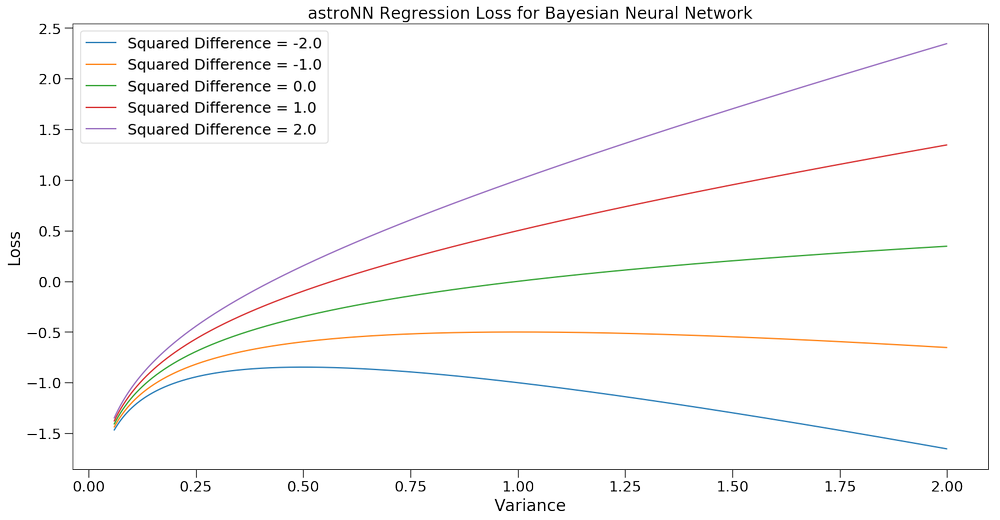

.. automodule:: astroNN.nn.losses

.. automodule:: astroNN.nn.metrics

Loss Functions and Metrics - **astroNN.nn.losses**
==================================================

astroNN provides modified loss functions which are capable to deal with incomplete labels which are represented by ``magicnumber``
in astroNN configuration file or ``Magic Number`` in equations below.
Since they are built on Tensorflow and follows Keras API requirement, all astroNN loss functions are fully compatible
with Keras with Tensorflow backend, as well as directly be imported and used with Tensorflow, for most loss functions, the
first argument is ground truth tensor and the second argument is prediction tensor from neural network.

.. note:: Always make sure when you are normalizing your data, keep the magic number as magic number. If you use astroNN normalizer, astroNN will take care of that.

Here are some explanations on variables in the following loss functions:

:math:`y_i` means the ground truth labels, always represented by python variable ``y_true`` in astroNN

:math:`\hat{y_i}` means the prediction from neural network, always represented by python variable ``y_pred`` in astroNN

Correction Term for Magic Number
----------------------------------

.. autofunction:: astroNN.nn.magic_correction_term

Since astroNN deals with magic number by assuming the prediction from neural network for those ground truth with Magic Number
is right, so we need a correction term.

The correction term in astroNN is defined by the following equation and we call the equation :math:`\mathcal{F}_{correction}`

.. math::

   \mathcal{F}_{correction} = \frac{\text{Non-Magic Number Count} + \text{Magic Number Count}}{\text{Non Magic Number Count}}

In case of no labels with Magic Number is presented, :math:`\mathcal{F}_{correction}` will equal to 1

Mean Squared Error
-----------------------

.. autofunction:: astroNN.nn.losses.mean_squared_error

MSE is based on the equation

.. math::

   Loss_i = \begin{cases}
        \begin{split}
            (\hat{y_i}-y_i)^2 & \text{ for } y_i \neq \text{Magic Number}\\
            0 & \text{ for } y_i = \text{Magic Number}
        \end{split}
    \end{cases}

And thus the loss for mini-batch is

.. math::

   Loss_{NN} = \frac{1}{D} \sum_{i=1}^{batch} (Loss_i \mathcal{F}_{correction, i})

It can be used with Keras, you just have to import the function from astroNN

.. code-block:: python

    def keras_model():
        # Your keras_model define here
        return model

    model = keras_model()
    # remember to import astroNN's loss function first
    model.compile(loss=mean_squared_error, ...)

Mean Absolute Error
-----------------------

.. autofunction:: astroNN.nn.losses.mean_absolute_error

MAE is based on the equation

.. math::

   Loss_i = \begin{cases}
        \begin{split}
            \left| \hat{y_i}-y_i \right| & \text{ for } y_i \neq \text{Magic Number}\\
            0 & \text{ for } y_i = \text{Magic Number}
        \end{split}
    \end{cases}

And thus the loss for mini-batch is

.. math::

   Loss_{NN} = \frac{1}{D} \sum_{i=1}^{batch} (Loss_i \mathcal{F}_{correction, i})

It can be used with Keras, you just have to import the function from astroNN

.. code-block:: python

    def keras_model():
        # Your keras_model define here
        return model

    model = keras_model()
    # remember to import astroNN's loss function first
    model.compile(loss=mean_absolute_error, ...)

Mean Error
--------------

.. autofunction:: astroNN.nn.losses.mean_error

Mean Error is a metrics to evaluate the bias of prediction and is based on the equation

.. math::

   Loss_i = \begin{cases}
        \begin{split}
            \hat{y_i}-y_i & \text{ for } y_i \neq \text{Magic Number}\\
            0 & \text{ for } y_i = \text{Magic Number}
        \end{split}
    \end{cases}

And thus the loss for mini-batch is

.. math::

   Loss_{NN} = \frac{1}{D} \sum_{i=1}^{batch} (Loss_i \mathcal{F}_{correction, i})

It can be used with Keras, you just have to import the function from astroNN

.. code-block:: python

    def keras_model():
        # Your keras_model define here
        return model

    model = keras_model()
    # remember to import astroNN's loss function first
    model.compile(loss=mean_error, ...)

Regression Loss and Predictive Variance Loss for Bayesian Neural Net
------------------------------------------------------------------------

.. autofunction:: astroNN.nn.losses.robust_mse

.. autofunction:: astroNN.nn.losses.mse_lin_wrapper

.. autofunction:: astroNN.nn.losses.mse_var_wrapper

It is based on the equation implemented as `robust_mse()`, please notice :math:`s_i` is  representing
:math:`log((\sigma_{predictive, i})^2 + (\sigma_{known, i})^2)`. Neural network not predicting variance
directly to avoid numerical instability but predicting :math:`log((\sigma_{i})^2)`

.. math::

   Loss_i = \begin{cases}
        \begin{split}
            \frac{1}{2} (\hat{y_i}-y_i)^2 e^{-s_i} + \frac{1}{2}(s_i) & \text{ for } y_i \neq \text{Magic Number}\\
            0 & \text{ for } y_i = \text{Magic Number}
        \end{split}
    \end{cases}

And thus the loss for mini-batch is

.. math::

   Loss_{BNN} = \frac{1}{D} \sum_{i=1}^{batch} (Loss_i \mathcal{F}_{correction, i})

They basically do the same things and can be used with Keras, you just have to import the functions from astroNN

.. code-block:: python

    def keras_model():
        # Your keras_model define here

        # model for the training process
        model = Model(inputs=[input_tensor, labels_err_tensor], outputs=[output, variance_output])

        # model for the prediction
        model_prediction = Model(inputs=input_tensor, outputs=[output, variance_output])

        variance_output = Dense(name='variance_output', ...)
        output = Dense(name='output', ...)

        predictive_variance_loss = mse_var_wrapper(output, labels_err_tensor)
        output_loss = mse_lin_wrapper(predictive_variance, labels_err_tensor)

        return model, model_prediction, output_loss, predictive_variance_loss

    model, model_prediction, output_loss, predictive_variance_loss = keras_model()
    # remember to import astroNN loss function first
    model.compile(loss={'output': output_loss, 'variance_output': predictive_variance_loss}, ...)

To better understand this loss function, you can see the following plot of Loss vs Variance colored by squared difference which is :math:`(\hat{y_i}-y_i)^2`

Mean Squared Logarithmic Error
--------------------------------

.. autofunction:: astroNN.nn.losses.mean_squared_logarithmic_error

MSLE  will first clip the values of prediction from neural net for the sake of numerical stability,

.. math::

   y_i = \begin{cases}
        \begin{split}
            \epsilon + 1 & \text{ for } y_i < \epsilon \\
            y_i + 1 & \text{ for otherwise }
        \end{split}
    \end{cases}

   \text{where } \epsilon \text{ is a small constant}

Then MSLE is based on the equation

.. math::

   Loss_i = \begin{cases}
        \begin{split}
            (\log{(\hat{y_i})} - \log{(y_i)})^2 & \text{ for } y_i \neq \text{Magic Number}\\
            0 & \text{ for } y_i = \text{Magic Number}
        \end{split}
    \end{cases}

And thus the loss for mini-batch is

.. math::

   Loss_{NN} = \frac{1}{D} \sum_{i=1}^{batch} (Loss_i \mathcal{F}_{correction, i})

It can be used with Keras, you just have to import the function from astroNN

.. code-block:: python

    def keras_model():
        # Your keras_model define here
        return model

    model = keras_model()
    # remember to import astroNN's loss function first
    model.compile(loss=mean_squared_logarithmic_error, ...)

Mean Absolute Percentage Error
--------------------------------

.. autofunction:: astroNN.nn.losses.mean_absolute_percentage_error

Mean Absolute Percentage Error will first clip the values of prediction from neural net for the sake of numerical stability,

.. math::

   y_i = \begin{cases}
        \begin{split}
            \epsilon  & \text{ for } y_i < \epsilon \\
            y_i & \text{ for otherwise }
        \end{split}
    \end{cases}

   \text{where } \epsilon \text{ is a small constant}

Then Mean Absolute Percentage Error is based on the equation

.. math::

   Loss_i = \begin{cases}
        \begin{split}
            100 \text{ } \frac{\left| y_i - \hat{y_i} \right|}{y_i} & \text{ for } y_i \neq \text{Magic Number}\\
            0 & \text{ for } y_i = \text{Magic Number}
        \end{split}
    \end{cases}

And thus the loss for mini-batch is

.. math::

   Loss_{NN} = \frac{1}{D} \sum_{i=1}^{batch} (Loss_i \mathcal{F}_{correction, i})

It can be used with Keras, you just have to import the function from astroNN

.. code-block:: python

    def keras_model():
        # Your keras_model define here
        return model

    model = keras_model()
    # remember to import astroNN's loss function first
    model.compile(loss=mean_absolute_percentage_error, ...)

Categorical Cross-Entropy
----------------------------

.. autofunction:: astroNN.nn.losses.categorical_crossentropy

Categorical Cross-Entropy will first clip the values of prediction from neural net for the sake of numerical stability if
the prediction is not coming from logits (before softmax activated)

.. math::

   \hat{y_i} = \begin{cases}
        \begin{split}
            \epsilon & \text{ for } \hat{y_i} < \epsilon \\
            1 - \epsilon & \text{ for } \hat{y_i} > 1 - \epsilon \\
            \hat{y_i} & \text{ for otherwise }
        \end{split}
    \end{cases}

   \text{where } \epsilon \text{ is a small constant}

and then based on the equation

.. math::

   Loss_i = \begin{cases}
        \begin{split}
            y_i \log{(\hat{y_i})} & \text{ for } y_i \neq \text{Magic Number}\\
            0 & \text{ for } y_i = \text{Magic Number}
        \end{split}
    \end{cases}

And thus the loss for mini-batch is

.. math::

   Loss_{NN} = - \frac{1}{D} \sum_{i=1}^{batch} (Loss_i \mathcal{F}_{correction, i})

It can be used with Keras, you just have to import the function from astroNN

.. code-block:: python

    def keras_model():
        # Your keras_model define here
        return model

    model = keras_model()
    # remember to import astroNN's loss function first
    model.compile(loss=categorical_crossentropy(from_logits=False), ...)

Binary Cross-Entropy
----------------------------

.. autofunction:: astroNN.nn.losses.binary_crossentropy

Binary Cross-Entropy will first clip the values of prediction from neural net for the sake of numerical stability if
``from_logits=False``

.. math::

   \hat{y_i} = \begin{cases}
        \begin{split}
            \epsilon & \text{ for } \hat{y_i} < \epsilon \\
            1 - \epsilon & \text{ for } \hat{y_i} > 1 - \epsilon \\
            \hat{y_i} & \text{ for otherwise }
        \end{split}
    \end{cases}

   \text{where } \epsilon \text{ is a small constant}

and then based on the equation

.. math::

   Loss_i = \begin{cases}
        \begin{split}
            y_i \log{(\hat{y_i})} + (1-y_i)\log{(1-\hat{y_i})} & \text{ for } y_i \neq \text{Magic Number}\\
            \hat{y_i} \log{(\hat{y_i})} + (1-\hat{y_i})\log{(1-\hat{y_i})} & \text{ for } y_i = \text{Magic Number}
        \end{split}
    \end{cases}

to avoid numerical instability if ``from_logits=True``, we can reformulate it as

.. math::

   Loss_i = \begin{cases}
        \begin{split}
            \max{(\hat{y_i}, 0)} - y_i \hat{y_i} + \log{(1+e^{-\|\hat{y_i}\|})} & \text{ for } y_i \neq \text{Magic Number}\\
            0 & \text{ for } y_i = \text{Magic Number}
        \end{split}
    \end{cases}

And thus the loss for mini-batch is

.. math::

   Loss_{NN} = - \frac{1}{D} \sum_{i=1}^{batch} (Loss_i \mathcal{F}_{correction, i})

It can be used with Keras, you just have to import the function from astroNN

.. code-block:: python

    def keras_model():
        # Your keras_model define here
        return model

    model = keras_model()
    # remember to import astroNN's loss function first
    model.compile(loss=binary_crossentropy(from_logits=False), ...)

Categorical Cross-Entropy and Predictive Logits Variance for Bayesian Neural Net
-----------------------------------------------------------------------------------

.. autofunction:: astroNN.nn.losses.robust_categorical_crossentropy

.. autofunction:: astroNN.nn.losses.bayesian_categorical_crossentropy_wrapper

.. autofunction:: astroNN.nn.losses.bayesian_categorical_crossentropy_var_wrapper

It is based on Equation 12 from `arxiv:1703.04977`_. :math:`s_i` is  representing the predictive variance of logits

.. math::

   Loss_i = \begin{cases}
        \begin{split}
            \text{Categorical Cross-Entropy} + \text{Distorted Categorical Cross-Entropy} + e^{s_i} - 1 & \text{ for } y_i \neq \text{Magic Number}\\
            0 & \text{ for } y_i = \text{Magic Number}
        \end{split}
    \end{cases}

where `Distorted Categorical Cross-Entropy` is defined as

.. math::

    \text{elu} (\text{Categorical Cross-Entropy}(y_i, \hat{y_i}) - \text{Categorical Cross-Entropy}(y_i, \mathcal{N}(\hat{y_i}, \sqrt{s_i})))

And thus the loss for mini-batch is

.. math::

   Loss_{BNN} = \frac{1}{D} \sum_{i=1}^{batch} (Loss_i \mathcal{F}_{correction, i})

`bayesian_categorical_crossentropy_wrapper` is for the prediction neurones

`bayesian_categorical_crossentropy_var_wrapper` is for the predictive variance neurones

They basically do the same things and can be used with Keras, you just have to import the functions from astroNN

.. code-block:: python

    def keras_model():
        # Your keras_model define here

        # model for the training process
        model = Model(inputs=[input_tensor], outputs=[output, variance_output])

        # model for the prediction
        model_prediction = Model(inputs=input_tensor, outputs=[output, variance_output])

        variance_output = Dense(name='predictive_variance', ...)
        output = Dense(name='output', ...)

        predictive_variance_loss = bayesian_categorical_crossentropy_var_wrapper(output)
        output_loss = bayesian_categorical_crossentropy_wrapper(predictive_variance)

        return model, model_prediction, output_loss, predictive_variance_loss

    model, model_prediction, output_loss, predictive_variance_loss = keras_model()
    # remember to import astroNN loss function first
    model.compile(loss={'output': output_loss, 'variance_output': predictive_variance_loss}, ...)

Binary Cross-Entropy and Predictive Logits Variance for Bayesian Neural Net
-----------------------------------------------------------------------------------

.. autofunction:: astroNN.nn.losses.robust_binary_crossentropy

.. autofunction:: astroNN.nn.losses.bayesian_binary_crossentropy_wrapper

.. autofunction:: astroNN.nn.losses.bayesian_binary_crossentropy_var_wrapper

It is based on Equation 12 from `arxiv:1703.04977`_. :math:`s_i` is  representing the predictive variance of logits

.. math::

   Loss_i = \begin{cases}
        \begin{split}
            \text{Binary Cross-Entropy} + \text{Distorted Binary Cross-Entropy} + e^{s_i} - 1 & \text{ for } y_i \neq \text{Magic Number}\\
            0 & \text{ for } y_i = \text{Magic Number}
        \end{split}
    \end{cases}

where `Distorted Binary Cross-Entropy` is defined as

.. math::

    \text{elu} (\text{Binary Cross-Entropy}(y_i, \hat{y_i}) - \text{Binary Cross-Entropy}(y_i, \mathcal{N}(\hat{y_i}, \sqrt{s_i})))

And thus the loss for mini-batch is

.. math::

   Loss_{BNN} = \frac{1}{D} \sum_{i=1}^{batch} (Loss_i \mathcal{F}_{correction, i})

`bayesian_binary_crossentropy_wrapper` is for the prediction neurones

`bayesian_binary_crossentropy_var_wrapper` is for the predictive variance neurones

They basically do the same things and can be used with Keras, you just have to import the functions from astroNN

.. code-block:: python

    def keras_model():
        # Your keras_model define here

        # model for the training process
        model = Model(inputs=[input_tensor], outputs=[output, variance_output])

        # model for the prediction
        model_prediction = Model(inputs=input_tensor, outputs=[output, variance_output])

        variance_output = Dense(name='predictive_variance', ...)
        output = Dense(name='output', ...)

        predictive_variance_loss = bayesian_binary_crossentropy_var_wrapper(output)
        output_loss = bayesian_binary_crossentropy_wrapper(predictive_variance)

        return model, model_prediction, output_loss, predictive_variance_loss

    model, model_prediction, output_loss, predictive_variance_loss = keras_model()
    # remember to import astroNN loss function first
    model.compile(loss={'output': output_loss, 'variance_output': predictive_variance_loss}, ...)

.. _arxiv:1703.04977: https://arxiv.org/abs/1703.04977

Categorical Classification Accuracy
------------------------------------

.. autofunction:: astroNN.nn.losses.categorical_accuracy

Categorical Classification Accuracy will first deal with Magic Number

.. math::

   Loss_i = \begin{cases}
        \begin{split}
            y_i & \text{ for } y_i \neq \text{Magic Number}\\
            0 & \text{ for } y_i = \text{Magic Number}
        \end{split}
    \end{cases}

Then based on the equation

.. math::

   Accuracy_i = \begin{cases}
        \begin{split}
          1 & \text{ for } \text{Argmax}(y_i) = \text{Argmax}(\hat{y_i})\\
          0 & \text{ for } \text{Argmax}(y_i) \neq \text{Argmax}(\hat{y_i})
        \end{split}
    \end{cases}

And thus the accuracy for is

.. math::

   Accuracy = \frac{1}{D} \sum_{i=1}^{labels} (Accuracy_i \mathcal{F}_{correction, i})

It can be used with Keras, you just have to import the function from astroNN

.. code-block:: python

    def keras_model():
        # Your keras_model define here
        return model

    model = keras_model()
    # remember to import astroNN's metrics function first
    model.compile(metrics=categorical_accuracy, ...)

.. note:: Please make sure you use categorical_accuracy when using categorical_crossentropy as the loss function

Binary Classification Accuracy
---------------------------------

.. autofunction:: astroNN.nn.losses.binary_accuracy

Binary Classification Accuracy will round the values of prediction if ``from_logits=False`` or will apply sigmoid
first and then round the values of prediction if ``from_logits=True``

.. math::

   \hat{y_i} = \begin{cases}
        \begin{split}
            1 & \text{ for } \hat{y_i} > 0.5 \\
            0 & \text{ for } \hat{y_i} \leq 0.5
        \end{split}
    \end{cases}

and then based on the equation

.. math::

   Accuracy_i = \begin{cases}
        \begin{split}
          1 & \text{ for } y_i = \hat{y_i}\\
          0 & \text{ for } y_i \neq \hat{y_i}
        \end{split}
    \end{cases}

And thus the accuracy for is

.. math::

   Accuracy = \frac{1}{D} \sum_{i=1}^{labels} (Accuracy_i \mathcal{F}_{correction, i})

It can be used with Keras, you just have to import the function from astroNN

.. code-block:: python

    def keras_model():
        # Your keras_model define here
        return model

    model = keras_model()
    # remember to import astroNN's metrics function first
    model.compile(metrics=binary_accuracy(from_logits=False), ...)

.. note:: Please make sure you use binary_accuracy when using binary_crossentropy as the loss function

Zeros Loss
---------------------------------

.. autofunction:: astroNN.nn.losses.zeros_loss

``zeros_loss`` is a loss function that will always return zero loss and the function matches Keras API. It is mainly
designed to do testing or experiments.

It can be used with Keras, you just have to import the function from astroNN

.. code-block:: python

    def keras_model():
        # Your keras_model define here
        return model

    model = keras_model()
    # remember to import astroNN's loss function first
    model.compile(loss=zeros_loss, ...)
