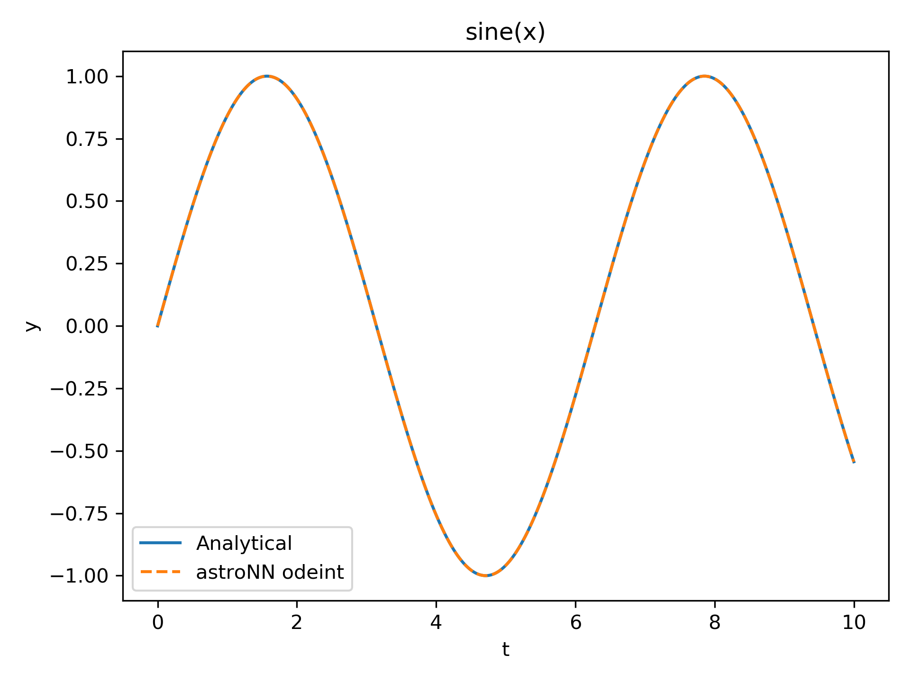

.. automodule:: astroNN.neuralode

NeuralODR - **astroNN.neuralODE**
===================================

Neural ODE (Neural Ordinary Differential Equation) module provides numerical integrator implemented in ``Tensorflow``
for solutions of an ODE system, and can calculate gradient.

Numerical Integrator
-----------------------

``astroNN`` implemented numerical integrator in ``Tensorflow``

.. automodule:: astroNN.neuralode.odeint

.. autofunction::  astroNN.neuralode.odeint.odeint

An example integration an ODE for ``sin(x)``

.. code-block:: python

    import time
    import pylab as plt
    import numpy as np
    import tensorflow as tf
    from astroNN.shared.nn_tools import cpu_fallback, gpu_memory_manage
    from astroNN.neuralode import odeint

    cpu_fallback()
    gpu_memory_manage()

    # time array
    t = tf.constant(np.linspace(0, 100, 10000))
    # initial condition
    true_y0 = tf.constant([0., 5.])
    # analytical ODE system for sine wave [x, t] -> [v, a]
    ode_func = lambda y, t: tf.stack([tf.cos(t), tf.sin(t)])

    start_t = time.time()
    true_y = odeint(ode_func, true_y0, t, method='dop853')
    print(time.time() - start_t)  # approx. 4.3 seconds on i7-9750H GTX1650

    # plot the solution and compare
    plt.figure(dpi=144)
    plt.title("sine(x)")
    plt.plot(t, np.sin(t), label='Analytical')
    plt.plot(t, true_y[:, 0], ls='--', label='astroNN odeint')
    plt.legend(loc='best')
    plt.xlabel("t")
    plt.ylabel("y")
    plt.show()

Moreover ``odeint`` supports numerically integration in parallel, the example below integration the ``sin(x)`` for 50 initial
conditions. You can see the execution time is the same!!

.. code-block:: python

    start_t = time.time()
    # initial conditions, 50 of them instead of a single initial condition
    true_y0sss = tf.random.normal((50, 2), 0, 1)
    true_y = odeint(ode_func, true_y0sss, t, method='dop853')
    print(time.time() - start_t)  # also approx. 4.3 seconds on i7-9750H GTX1650

Neural Network model with Numerical Integrator
------------------------------------------------

You can use ``odeint`` along with neural network model, below is an example

.. code-block:: python

    import numpy as np
    import tensorflow as tf
    from astroNN.shared.nn_tools import gpu_memory_manage
    from astroNN.neuralode import odeint

    gpu_memory_manage()

    t = tf.constant(np.linspace(0, 1, 2))
    # initial condition
    true_y0 = tf.constant([1., 5.])

    class MyModel(tf.keras.Model):
        def __init__(self):
            super(MyModel, self).__init__()
            self.dense1 = tf.keras.layers.Dense(2, activation=tf.nn.relu)
            self.dense2 = tf.keras.layers.Dense(16, activation=tf.nn.relu)
            self.dense3 = tf.keras.layers.Dense(2)

        def call(self, inputs, t, *args):
            inputs = tf.expand_dims(inputs, axis=0)
            x = self.dense2(self.dense1(inputs))
            return tf.squeeze(self.dense3(x))

    model = MyModel()

    with tf.GradientTape() as g:
        g.watch(true_y0)
        y = odeint(model, true_y0, t)
    # gradient of the result w.r.t. model's weights
    g.gradient(y, model.trainable_variables)  # well define, no None, no inf or no NaN
