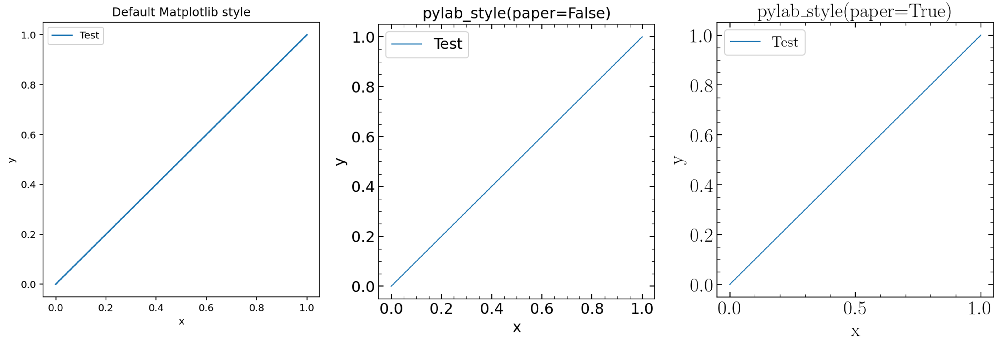

Publications using astroNN
===========================

#. | Deep learning of multi-element abundances from high-resolution spectroscopic data
   | Henry W. Leung, Jo Bovy (2019)
   | `MNRAS, 483, 3255L <https://ui.adsabs.harvard.edu/abs/2019MNRAS.483.3255L/abstract>`_
   | Original ``astroNN`` paper

#. | Dynamical heating across the Milky Way disc using APOGEE and Gaia
   | J. Ted Mackereth, Jo Bovy, Henry W. Leung, et al. (2019)
   | `MNRAS, 489, 176M <https://ui.adsabs.harvard.edu/abs/2019MNRAS.489..176M/abstract>`_
   | Use ``ApogeeBCNN`` to infer spectroscopic age

#. | Simultaneous calibration of spectro-photometric distances and the Gaia DR2 parallax zero-point offset with deep learning
   | Henry W. Leung, Jo Bovy (2019)
   | `MNRAS, 489, 2079L <https://ui.adsabs.harvard.edu/abs/2019MNRAS.489.2079L/abstract>`_
   | Use ``ApogeeDR14GaiaDR2BCNN`` to infer spectro-photometric distances

#. | Solar image denoising with convolutional neural networks
   | C. J. Díaz Baso, J. de la Cruz Rodríguez, S. Danilovic (2019)
   | `A&A, 629, 99D  <https://ui.adsabs.harvard.edu/abs/2019A%26A...629A..99D/abstract>`_

#. | A variational encoder-decoder approach to precise spectroscopic age estimation for large Galactic surveys
   | Henry W. Leung, Jo Bovy, J. Ted Mackereth, Andrea Miglio (2023)
   | `arXiv:2302.05479  <https://ui.adsabs.harvard.edu/abs/2023arXiv230205479L/abstract>`_
   | Use ``ApokascEncoderDecoder`` to infer spectroscopic age trained on APOGEE and Kepler

Publication figure style
------------------------------

``astroNN`` contains a function that helps me to standardize maplotlib figure style used in my publication.

.. autofunction:: astroNN.shared.matplotlib.pylab_style

Such function can be used by simply calling it before using matplotlib to plot any figure

.. code-block:: python
    :linenos:
    
    import matplotlib.pylab as plt
    from astroNN.shared import pylab_style

    pylab_style(paper=True)

    # matplotlib code goes here

If you do not have :math:`\LaTeX` installed on your computer, you can set the paper option to False like ``pylab_style(paper=False)``

Here are a figure that compare different styles using the following matplotlib code

.. code-block:: python
    :linenos:
    
    plt.figure(figsize=(5, 5))
    plt.plot([0, 1], [0, 1], label="Test")
    plt.xlabel("x")
    plt.ylabel("y")
    plt.legend()

