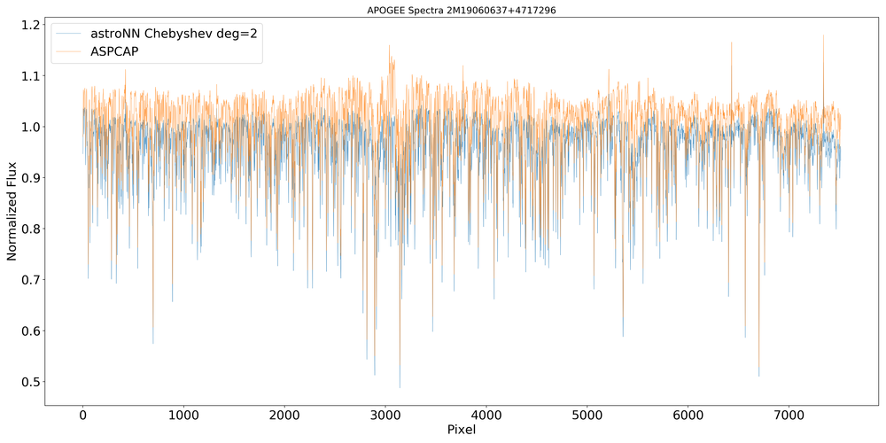

Mini Tools for APOGEE data
=============================

.. note:: astroNN only contains a limited amount of neccessary tools. For a more comprehansive python tool to deal with APOGEE data, please refer to Jo Bovy's `APOGEE tools`_

.. _APOGEE tools: hhttps://github.com/jobovy/apogee

Pesudo-Continuum Normalization of Spectra
--------------------------------------------

You can access the default astroNN continuum mask by

.. code:: python

   import os
   import astroNN
   import numpy as np

   dr = 14

   dir = os.path.join(os.path.dirname(astroNN.__path__[0]), 'astroNN', 'data', 'dr{}_contmask.npy'.format(dr))
   cont_mask = np.load(dir)

When you do normalization using astroNN, you can just use con_mask=None to use default mask

.. code:: python

   from astroNN.apogee import continuum

   # spectra_errs refers to the 1-sigma error array provided by APOGEE
   spec, spec_err = continuum(spectra, spectra_errs, cont_mask=None, deg=2, dr=14)

`spec` refers to the normalized spectra while `spec_err` refers to the normalized spectra error

.. note:: If you are planning to compile APOGEE dataset using astroNN, you can ignore this section as astroNN H5Compiler will load data from fits files directly and will take care everything.

Retrieve basic APOGEE spectra pixel information
-------------------------------------------------

You can retrieve basic APOGEE spectra pixel information by

.. code:: python

   from astroNN.apogee import chips_pix_info

   info = chips_pix_info(dr=14)

   # info[0] refers to the location where blue chips starts
   # info[1] refers to the location where blue chips ends
   # info[2] refers to the location where green chips starts
   # info[3] refers to the location where blue chips end
   # info[4] refers to the location where red chips starts
   # info[5] refers to the location where red chips ends
   # info[6] refers to the total number of pixels after deleting gap

APOGEE spectra wavelength solution
------------------------------------

You can retrieve APOGEE spectra wavelength solution by

.. code:: python

   from astroNN.apogee import wavelength_solution

   lambda_blue, lambda_green, lambda_red = wavelength_solution(dr=14)

   # lambda_blue refers to the wavelength solution for each pixel in blue chips
   # lambda_green refers to the wavelength solution for each pixel in green chips
   # lambda_red refers to the wavelength solution for each pixel in red chips

APOGEE spectra gap delete
------------------------------------

You can delete the gap between raw spectra by

.. code:: python

   from astroNN.apogee import gap_delete

   gap_deleted_spectra = gap_delete(original_spectra, dr=14)

Split APOGEE spectra into three detectors
------------------------------------------

You can split APOGEE spectra into three detectors by

.. code:: python

   from astroNN.apogee import chips_split

   spectra_blue, spectra_green, spectra_red = chips_split(original_spectra, dr=14)

`chips_split()` will delete the gap between the detectors if you supply a raw spectra. If you give a gap deteleted spectra,
then the function will simply split the spectra into three

APOGEE data downloaders
---------------------------

astroNN apogee data downloader always act as functions that will return you the path of downloaded file(s), and download it if it does not exist locally.

-----------------------------------
General way to open the fits file
-----------------------------------

astropy.io.fits documentation: http://docs.astropy.org/en/stable/io/fits/

.. code:: python

   from astropy.io import fits

   data = fits.open(local_path_to_file)

--------------
 allstar file
--------------

Data Model: https://data.sdss.org/datamodel/files/APOGEE_REDUX/APRED_VERS/APSTAR_VERS/ASPCAP_VERS/RESULTS_VERS/allStar.html

.. code:: python

   from astroNN.apogee import allstar

   local_path_to_file = allstar(dr=14)

---------------
 allvisit file
---------------

Data Model: https://data.sdss.org/datamodel/files/APOGEE_REDUX/APRED_VERS/APSTAR_VERS/ASPCAP_VERS/RESULTS_VERS/allVisit.html

.. code:: python

   from astroNN.apogee import allvisit

   local_path_to_file = allvisit(dr=14)

------------------------------
Combined spectra (aspcapStar)
------------------------------

Data Model: https://data.sdss.org/datamodel/files/APOGEE_REDUX/APRED_VERS/APSTAR_VERS/ASPCAP_VERS/RESULTS_VERS/LOCATION_ID/aspcapStar.html

.. code:: python

   from astroNN.apogee import combined_spectra

   local_path_to_file = combined_spectra(dr=14, location=a_location_id, apogee=a_apogee_id)

------------------------------
Visit spectra (apStar)
------------------------------

Data Model: https://data.sdss.org/datamodel/files/APOGEE_REDUX/APRED_VERS/APSTAR_VERS/TELESCOPE/LOCATION_ID/apStar.html

.. code:: python

   from astroNN.apogee import visit_spectra

   local_path_to_file = visit_spectra(dr=14, location=a_location_id, apogee=a_apogee_id)

-----------------------------------------
Red Clumps of SDSS Value Added Catalogs
-----------------------------------------

Introduction: http://www.sdss.org/dr14/data_access/value-added-catalogs/?vac_id=apogee-red-clump-rc-catalog

Data Model (DR14): https://data.sdss.org/datamodel/files/APOGEE_RC/cat/apogee-rc-DR14.html

.. code:: python

   from astroNN.apogee.downloader import apogee_vac_rc

   local_path_to_file = apogee_vac_rc(dr=14)

-----------------------------------------
APOKASC in the Kepler Fields
-----------------------------------------

.. code:: python

   from astroNN.datasets.apokasc import apokasc_load

   gold_ra, gold_dec, gold_logg, basic_ra, basic_dec, basic_logg = apokasc_load()

-----------------------------------------
APOGEE DR14-Based Distance Estimations
-----------------------------------------

Introduction: http://www.sdss.org/dr14/data_access/value-added-catalogs/?vac_id=apogee-dr14-based-distance-estimations

Data Model (DR14): https://data.sdss.org/datamodel/files/APOGEE_DISTANCES/apogee_distances.html

.. code:: python

   from astroNN.apogee.downloader import apogee_distances

   local_path_to_file = apogee_distances(dr=14)

--------------------
Cannon's allstar
--------------------

Introduction: https://data.sdss.org/datamodel/files/APOGEE_REDUX/APRED_VERS/APSTAR_VERS/ASPCAP_VERS/RESULTS_VERS/CANNON_VERS/cannonModel.html

Data Model (DR14): https://data.sdss.org/datamodel/files/APOGEE_REDUX/APRED_VERS/APSTAR_VERS/ASPCAP_VERS/RESULTS_VERS/CANNON_VERS/allStarCannon.html

.. code:: python

   from astroNN.apogee.downloader import apogee_distances

   local_path_to_file = apogee_distances(dr=14)
