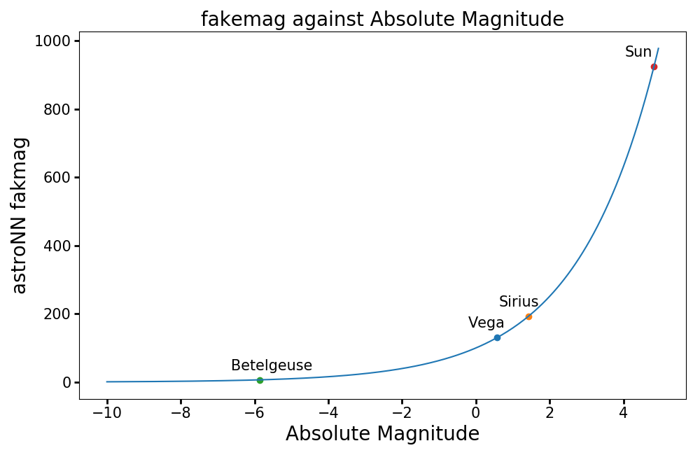

Mini Tools for Gaia data
===========================

.. note:: astroNN only contains a limited amount of necessary tools. For a more comprehensive python tool to deal with Gaia data, please refer to Jo Bovy's `gaia_tools`_

.. _gaia_tools: https://github.com/jobovy/gaia_tools

Gaia Data Downloader
---------------------------

astroNN Gaia data downloader always act as functions that will return you the path of downloaded file(s),
and download it if it does not exist locally. If the file cannot be found on server, astroNN will generally return ``False`` as the path.

----------------------------
TGAS Downloader and Loader
----------------------------

To download TGAS

.. code-block:: python

    from astroNN.gaia import tgas

    # To download tgas dr1 to GAIA_TOOLS_DATA and it will return the list of path to those files
    files_paths = tgas(dr=1)

To load Gaia TGAS

.. code-block:: python

    from astroNN.gaia import tgas_load

    # To load the tgas DR1 files and return a dictionary of ra(J2015), dec(J2015), pmra, pmdec, parallax, parallax error, g-band mag
    # cuts=True to cut bad data (negative parallax and percentage error more than 20%)
    output = tgas_load(dr=1, cuts=True)

    # outout dictionary
    output['ra']  # ra(J2015)
    output['dec']  # dec(J2015)
    output['pmra']  # proper motion in RA
    output['pmdec']  # proper motion in DEC
    output['parallax']  # parallax
    output['parallax_err']  # parallax error
    output['gmag']  # g-band mag

--------------------------
Gaia_source Downloader
--------------------------

.. code-block:: python

    from astroNN.gaia import gaia_source

    # To download gaia_source DR1 to GAIA_TOOLS_DATA and it will return the list of path to those files
    files_paths = gaia_source(dr=1)

-------------------------------------------------------------------------
Anderson et al 2017 Improved Parallax from Data-driven Stars Model
-------------------------------------------------------------------------

.. code-block:: python

    from astroNN.gaia import anderson_2017_parallax

    # To load the improved parallax
    # Both parallax and para_var is in mas
    # cuts=True to cut bad data (negative parallax and percentage error more than 20%)
    ra, dec, parallax, para_err = anderson_2017_parallax(cuts=True)

fakemag (dummy scale)
-------------------------------

``fakemag`` is an astroNN dummy scale primarily used to preserve the gaussian standard error from Gaia satellite. astroNN
always assume there is no error in apparent magnitude measurement

:math:`M_{fakemag} = \omega 10^{\frac{1}{5}M_{apparent}} = 10^{\frac{1}{5}M_{absolute}+2}`, where
:math:`\omega` is parallax in `mas`

You can get a sense of the fakemag scale from the following plot

Conversion Tools related to Astrometry and Magnitude
-----------------------------------------------------

``mag_to_fakemag(mag, parallax)`` takes parallax in mas and apparent magnitude to astroNN's fakemag

``mag_to_fakemag(mag, parallax, parallax_err)`` takes parallax and parallax standard error in mas and apparent magnitude
and return astroNN's fakemag and propagated fakemag standard error

``mag_to_absmag(mag, parallax)`` takes parallax in mas and apparent magnitude to absolute magnitude

``mag_to_absmag(mag, parallax, parallax_err)`` takes parallax and parallax standard error in mas and apparent
magnitude and return absolute magnitude and approx. propagated absolute magnitude error

``absmag_to_pc(absmag, mag)`` takes absolute magnitude and apparent magnitude to parsec, output is an numpy array with corresponding astropy Quantity

``fakemag_to_absmag(fakemag)``  takes fakemag to absolute magnitude

``absmag_to_fakemag(absmag)``  takes absolute magnitude to fakemag

``fakemag_to_pc(fakemag, mag)``  takes fakemag and apparent magnitude to parsec, output is an numpy array with corresponding astropy Quantity

``fakemag_to_pc(fakemag, mag, fakemag_err)``  takes fakemag and fakemag standard error and apparent magnitude to parsec
and propagated parsec standard error, outputs are numpy arrays with corresponding astropy Quantity

All of these functions preserve ``magicnumber`` in input(s) and can be imported by

.. code-block:: python

    from astroNN.gaia import ...

Preserving ``magicnumber`` means the indices which matched ``magicnumber`` in ``config.ini`` will be preserved, for example:

.. code-block:: python

    from astroNN.gaia import absmag_to_pc

    print(absmag_to_pc([1., -9999.], [2., 1.]))
    >>> <Quantity [15.84893192, -9999.] pc>

    print(absmag_to_pc([1., -9999.], [-9999., 1.]))
    >>> <Quantity [-9999., -9999.] pc>

Since some functions support astropy Quantity framework, you can convert between units easily. Example:

.. code-block:: python

    from astroNN.gaia import absmag_to_pc
    from astropy import units as u
    import numpy as np

    # Example data of [Vega, Sirius, Betelgeuse]
    absmag = np.array([0.582, 1.42, -5.85])
    mag = np.array([0.03, -1.46, 0.5])
    pc = absmag_to_pc(absmag, mag)  # The output - pc - carries astropy unit

    # Convert to AU
    distance_in_AU = pc.to(u.AU)

    # Or convert to angle units by using astropy's equivalencies function
    arcsec = pc.to(u.arcsec, equivalencies=u.parallax())

Since some functions support error propagation, lets say you are not familiar with ``fakemag`` and you want to know
how standard error in ``fakemag`` propagate to ``parsec``, you can for example

.. code-block:: python

    from astroNN.gaia import fakemag_to_pc

    fakemag = 300
    fakemag_err = 100
    apparent_mag = 10

    print(fakemag_to_pc(fakemag, apparent_mag, fakemag_err))
    >>> (<Quantity 333.33333333 pc>, <Quantity 111.11111111 pc>)

Coordinates Matching between catalogs using Bovy's xmatch
-------------------------------------------------------------

Coordinates matching between catalogue can be done by `xmatch` which is just an exact copy from Jo Bovy's `gaia_tools`

Here is the documentation of xmatch from Jo Bovy

.. code-block:: python

    xmatch(cat1,cat2,maxdist=2, colRA1='RA',colDec1='DEC',epoch1=2000., colRA2='RA',colDec2='DEC',epoch2=2000.,
           colpmRA2='pmra',colpmDec2='pmdec', swap=False)

    cat1 = First catalog
    cat2 = Second catalog
    maxdist = (2) maximum distance in arcsec
    colRA1 = ('RA') name of the tag in cat1 with the right ascension in degree in cat1 (assumed to be ICRS)
    colDec1 = ('DEC') name of the tag in cat1 with the declination in degree in cat1 (assumed to be ICRS)
    epoch1 = (2000.) epoch of the coordinates in cat1
    colRA2 = ('RA') name of the tag in cat2 with the right ascension in degree in cat2 (assumed to be ICRS)
    colDec2 = ('DEC') name of the tag in cat2 with the declination in degree in cat2 (assumed to be ICRS)
    epoch2 = (2000.) epoch of the coordinates in cat2
    colpmRA2 = ('pmra') name of the tag in cat2 with the proper motion in right ascension in degree in cat2
               (assumed to be ICRS; includes cos(Dec)) [only used when epochs are different]
    colpmDec2 = ('pmdec') name of the tag in cat2 with the proper motion in declination in degree in cat2
                (assumed to be ICRS) [only used when epochs are different]
    swap = (False) if False, find closest matches in cat2 for each cat1 source, if False do the opposite (important when one of the catalogs

Here is an example

.. code-block:: python

    from astroNN.datasets import xmatch
    import numpy as np

    # Some coordinates for cat1, J2000.
    cat1_ra = np.array([36.,68.,105.,23.,96.,96.])
    cat1_dec = np.array([72.,56.,54.,55.,88.,88.])

    # Some coordinates for cat2, J2000.
    cat2_ra = np.array([23.,56.,222.,96.,245.,68.])
    cat2_dec = np.array([36.,68.,82.,88.,26.,56.])

    # Using maxdist=2 arcsecond separation threshold, because its default, so not shown here
    # Using epoch1=2000. and epoch2=2000., because its default, so not shown here
    # because both datasets are J2000., so no need to provide pmra and pmdec which represent proper motion
    idx_1, idx_2, sep = xmatch(cat1_ra, cat2_ra, colRA1=cat1_ra, colDec1=cat1_dec, colRA2=cat2_ra, colDec2=cat2_dec, swap=False)

    print(idx_1)
    >>> [1 4 5]
    print(idx_2)
    >>> [5 3 3]
    print(cat1_ra[idx_1], cat2_ra[idx_2])
    >>> [68. 96. 96.], [68. 96. 96.]

    # What happens if we swap cat_1 and cat_2
    idx_1, idx_2, sep = xmatch(cat2_ra, cat1_ra, colRA1=cat2_ra, colDec1=cat2_dec, colRA2=cat1_ra, colDec2=cat1_dec, swap=False)

    print(idx_1)
    >>> [3 5]
    print(idx_2)
    >>> [4 1]
    print(cat1_ra[idx_2], cat2_ra[idx_1])
    >>> [96. 68.], [96. 68.]  # xmatch cant find all the match

    # Because we have some repeated index in cat2, we should turn swap=True
    idx_1, idx_2, sep = xmatch(cat2_ra, cat1_ra, colRA1=cat2_ra, colDec1=cat2_dec, colRA2=cat1_ra, colDec2=cat1_dec, swap=True)

    print(idx_1)
    >>> [5 3 3]
    print(idx_2)
    >>> [1 4 5]
    print(cat1_ra[idx_2], cat2_ra[idx_1])
    >>> [68. 96. 96.], [68. 96. 96.]  # Yea, seems like xmatch found all the matched
